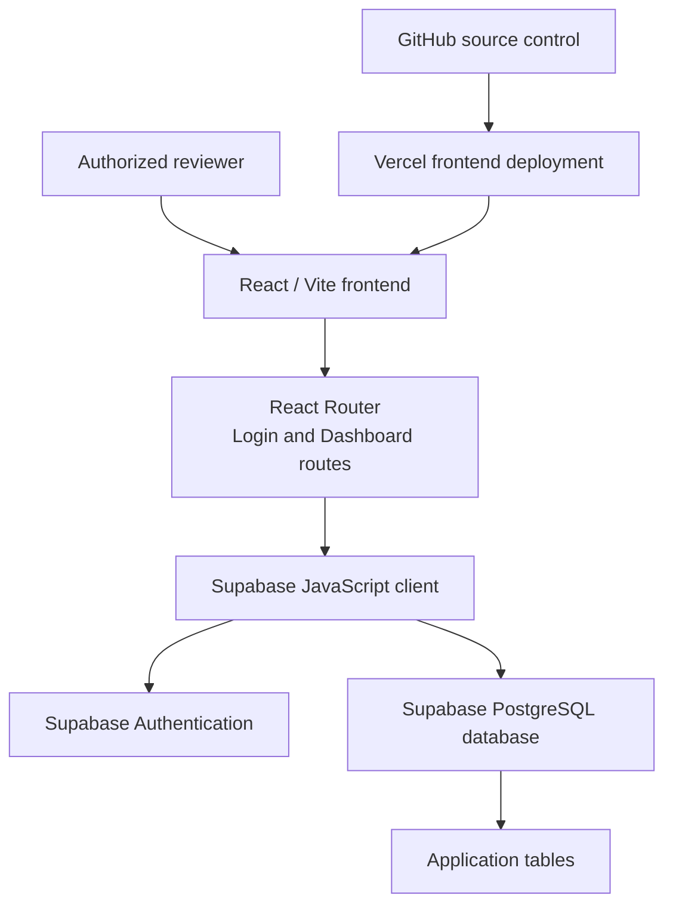
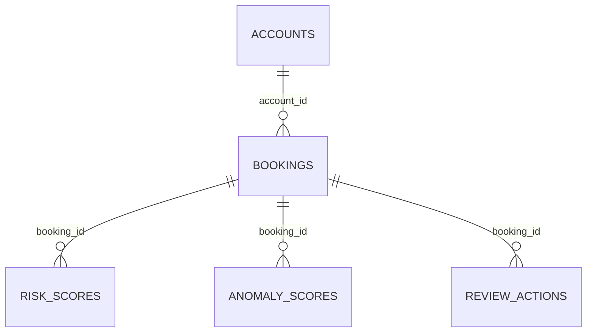
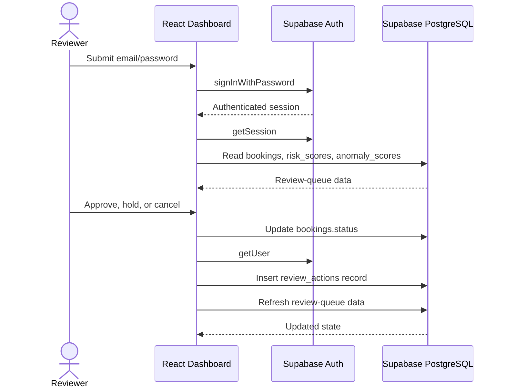

# Trusttix — System Architecture

## 1. Overview

Trusttix is a web-based fraud-operations console for reviewing booking activity, evaluating risk signals, and recording reviewer decisions in a centralized workspace. It is implemented as a React single-page application backed by Supabase services. Authorized users sign in, access a booking-review dashboard, inspect booking-associated risk and anomaly information, and persist a review decision.

This document describes the implemented architecture and the verified Supabase configuration for an academic Digital Business Systems submission. It deliberately separates current, verified behavior from recommendations. It does not assume unobserved database columns, custom APIs, server-side functions, triggers, machine-learning models, or security-policy conditions.

## 2. Problem Statement

Booking and ticketing workflows need a practical way to identify and handle activity that may require additional review. When booking information and risk signals are difficult to inspect together, reviewers may make slower or less consistent decisions and the resulting decision history can be hard to trace. Trusttix addresses this by presenting a focused operations dashboard in which a reviewer can see bookings with their associated risk and anomaly indicators, choose a decision, and record that decision in the shared application data store.

## 3. System Objectives

The current system is designed to:

- authenticate authorized users with email and password;
- prevent the dashboard from loading when no authenticated session is present;
- retrieve booking, risk-score, and anomaly-score records for review;
- associate score records with the relevant booking in the dashboard;
- allow a reviewer to approve, hold, or cancel a booking;
- update the booking status and record a review action; and
- provide a deployable web interface using managed Supabase and Vercel services.

## 4. High-Level Architecture

Trusttix follows a browser-to-managed-backend architecture. The React/Vite application runs in the user’s browser. Its Supabase JavaScript client communicates with Supabase Authentication and the Supabase PostgreSQL-backed data API. The repository contains no separate Express or Node.js backend server, custom API service, serverless function, or Edge Function.

## 5. Technology Stack

| Layer | Implemented technology | Role |
| --- | --- | --- |
| User interface | React 19, JavaScript/JSX, CSS | Renders login and booking-review experiences. |
| Build tooling | Vite | Develops and builds the frontend application. |
| Client-side navigation | React Router | Routes users between the login route and `/dashboard`. |
| Backend service | Supabase | Provides the managed authentication and database-access platform. |
| Authentication | Supabase Authentication | Provides email/password sign-in and authenticated sessions. |
| Data store | Supabase PostgreSQL database | Stores the verified application tables and review data. |
| Browser data client | `@supabase/supabase-js` | Makes Auth and database calls from the frontend. |
| Hosting | Vercel | Hosts the built frontend with SPA route rewriting. |
| Source control | Git and GitHub | Stores and versions the project source and documentation. |

## 6. Frontend Architecture

The frontend is a React 19 application built with Vite and written in JavaScript/JSX. React Router defines the `/` login route and the `/dashboard` review-console route. `Login.jsx` presents the email/password form. On submission, it calls `supabase.auth.signInWithPassword({ email, password })`; when sign-in succeeds, it navigates to the dashboard.

`Dashboard.jsx` is the principal operational screen. Before loading review data, it calls `supabase.auth.getSession()`. If there is no session, the application redirects to the login route. After session validation, it reads `bookings`, `risk_scores`, and `anomaly_scores` concurrently. The dashboard keeps score data in browser-memory lookup maps keyed by `booking_id`, then displays each booking with its available risk and anomaly information. It includes status filters for all, pending, clean, flagged, and cancelled records, plus a manual refresh action.

The shared `supabaseClient.js` module creates the Supabase client from the public `VITE_SUPABASE_URL` and `VITE_SUPABASE_ANON_KEY` build-time variables. The repository includes placeholder values only in `frontend/.env.example`; actual values are kept outside Git. The frontend makes direct, authenticated Supabase client calls rather than communicating with a project-owned API server.

## 7. Backend Architecture

Supabase is the implemented backend platform. It supplies two backend concerns used by Trusttix: Supabase Authentication for identity and session handling, and a PostgreSQL database exposed to the configured Supabase JavaScript client/API for application data access.

There is no separately implemented Express/Node backend server in the repository. No custom REST endpoint, RPC/database function, trigger, Edge Function, or custom middleware is present in the checked-in source. Consequently, the review workflow uses distinct frontend-originated operations: an update of the selected booking’s status followed by an insert of a review-action record. The code does not demonstrate a database transaction that groups those two operations.

## 8. Database Architecture

The verified Supabase database contains five core tables. `bookings` is the central transaction and review entity. The Schema Visualizer confirms the following relationships:

| Table | Verified role and fields available to this documentation |
| --- | --- |
| `accounts` | A core table related to `bookings` through `accounts.account_id → bookings.account_id`. No other account columns are documented here. |
| `bookings` | Central booking/review entity. Verified visible fields: `booking_id`, `account_id`, `event_id`, `device_id`, `payment_id`, `amount`, `seats`, `booking_time`, and `status`. |
| `risk_scores` | Stores risk information associated with a booking through `bookings.booking_id → risk_scores.booking_id`. The frontend uses `booking_id`, `score`, and `reasons`; no additional fields are asserted. |
| `anomaly_scores` | Stores anomaly information associated with a booking. Verified visible fields: `booking_id`, `anomaly_score`, `is_outlier`, and `computed_at`. |
| `review_actions` | Stores reviewer decisions associated with a booking. Verified visible fields: `id`, `booking_id`, `reviewed_by`, `decision`, and `action_time`. |

The frontend’s implementation reads all visible rows from `bookings`, `risk_scores`, and `anomaly_scores` and joins them in the browser by matching `booking_id`. The accounts table is part of the verified database model, but the current frontend does not query it directly; it displays the booking’s `account_id`. The relationship diagram represents the verified Schema Visualizer relationships and does not assert any additional constraints, cardinality rules beyond the diagram, indexes, or column types.

## 9. Authentication and Authorization

Email/password authentication is implemented through Supabase Authentication. The login component uses `signInWithPassword`; the dashboard uses `getSession` as its client-side access check; `getUser` obtains the current user for a review-action record; and `signOut` ends the user session. The dashboard does not load its review data until it has found a session.

Supabase screenshots verify that Row Level Security (RLS) is enabled on the core tables. The visible policy is named **“Allow authenticated read/write”**, has command **ALL**, and is applied to **public**. This policy is visibly present for `accounts`, `anomaly_scores`, `bookings`, and `review_actions`. No policy condition, additional policy, or policy status for `risk_scores` is asserted here because it was not provided as verified evidence.

The visible policy is broad: its documented scope is authenticated read/write access. More granular role- and action-based policies are not documented as currently implemented and would be an important future improvement.

## 10. Risk and Anomaly Processing

Risk and anomaly information supports reviewer judgment in the booking queue. For each booking, the frontend looks up the related `risk_scores` and `anomaly_scores` records by `booking_id`. It displays a rule score and the available risk reasons, as well as an anomaly score and outlier indicator. The dashboard applies presentation thresholds to color the displayed risk score; these are UI display rules, not verified database or risk-engine rules.

The repository does not contain code that calculates risk scores, computes anomalies, trains or invokes a machine-learning model, or defines an automated fraud-decision engine. This document therefore describes the current application as consuming stored risk and anomaly information for human review, rather than claiming how those values are produced.

## 11. Booking Review Workflow

1. A user opens the login route and submits email/password credentials.
2. Supabase Authentication processes the sign-in request and establishes a session when successful.
3. The dashboard validates the session with `getSession` before loading operational data.
4. The dashboard retrieves bookings, risk scores, and anomaly scores.
5. It associates risk and anomaly records with their booking by `booking_id` and renders the review queue.
6. The reviewer examines the booking context and chooses Approve, Hold, or Cancel.
7. The application updates `bookings.status` respectively to `clean`, `flagged`, or `cancelled`, using the selected `booking_id`.
8. It obtains the current user and inserts a related `review_actions` record with `booking_id`, `reviewed_by`, and `decision`.
9. The dashboard refreshes its data so that the reviewer sees the resulting state.

## 12. Review Actions and Auditability

The `review_actions` table provides the implemented decision-history mechanism. Its verified visible fields include an `id`, the related `booking_id`, the `reviewed_by` value, the selected `decision`, and `action_time`. In the current frontend, the inserted values are `booking_id`, `reviewed_by`, and `decision`; the reviewer identity is taken from `getUser().user.email`, with an `admin` fallback in the application code. The client does not supply `id` or `action_time` in that insert.

This produces a record associated with the reviewed booking and makes a decision available to database-backed audit history. The repository does not show the database definition responsible for generating identifiers or timestamps, nor does it implement an audit-reporting screen, immutable audit guarantee, or history query. Those details should not be inferred from the visible insert operation.

## 13. Data Flow

## 14. Security Considerations

Implemented security includes Supabase email/password authentication, a dashboard session check, RLS enabled on the verified core tables, and environment-variable based browser configuration. The repository’s `.gitignore` excludes `.env` files, while the committed example contains placeholders. Service-role keys, passwords, tokens, and other private credentials must not be placed in the frontend or committed to source control.

The current visible RLS policy is broad, so it should not be interpreted as fine-grained authorization. Recommended improvements include roles for reviewers, supervisors, and administrators; policy conditions that limit operations to the necessary users and records; review of client-side write permissions; and regular audit of deployed environment configuration. Least privilege is a recommendation, not a claim about the current policy beyond the verified RLS evidence.

## 15. Deployment Architecture

GitHub stores the source code and documentation. Vercel deploys the frontend from the `frontend` directory using the Vite build output. The included Vercel configuration supports SPA route handling so the `/dashboard` route can be opened directly. Supabase remains the hosted provider of Authentication and PostgreSQL database services. Deployment configuration must supply the public Supabase URL and anonymous/publishable browser key without committing environment files.

## 16. Scalability Considerations

The current dashboard fetches complete table result sets and performs booking-score association in the browser. This is suitable for the demonstrated implementation but may require change as the review queue grows. Future scalability work could introduce pagination, server-side filtering, search, sorting, appropriate database indexes, and query optimization after measuring actual workloads. Additional possible improvements are role-based access, more granular RLS, Supabase Realtime updates, monitoring, and operational alerting. None of these are claimed as implemented.

## 17. Current Limitations

The repository has no checked-in database migrations or SQL schema export, so database constraints, types, indexes, trigger behavior, and complete policy definitions are not reproduced in source control. The frontend has no direct accounts-table query or review-history view. It has no automated test suite for authentication or review operations, no pagination/search/sorting, no realtime subscription, and no separate backend transaction that atomically updates a booking and records its review action. Risk and anomaly value generation is outside the visible repository implementation.

## 18. Future Improvements

Future work may include role-based access control, granular RLS policies, advanced search and filtering, queue pagination, analytics dashboards, realtime queue updates, monitoring and structured error reporting, automated tests, and improved fraud analytics. Database migrations and a reviewed schema export could also be maintained in version control when safely retrieved from an authorized Supabase project. These are proposals and are not evidence of current implementation.

## 19. Conclusion

Trusttix implements a focused full-stack review workflow using a React/Vite frontend and Supabase-managed authentication and database services. Its verified database model centers on bookings and relates them to accounts, risk scores, anomaly scores, and review actions. The present architecture supports authenticated human review and persistence of booking decisions while clearly leaving more granular authorization, operational analytics, scalable querying, and advanced risk processing as future development opportunities.
